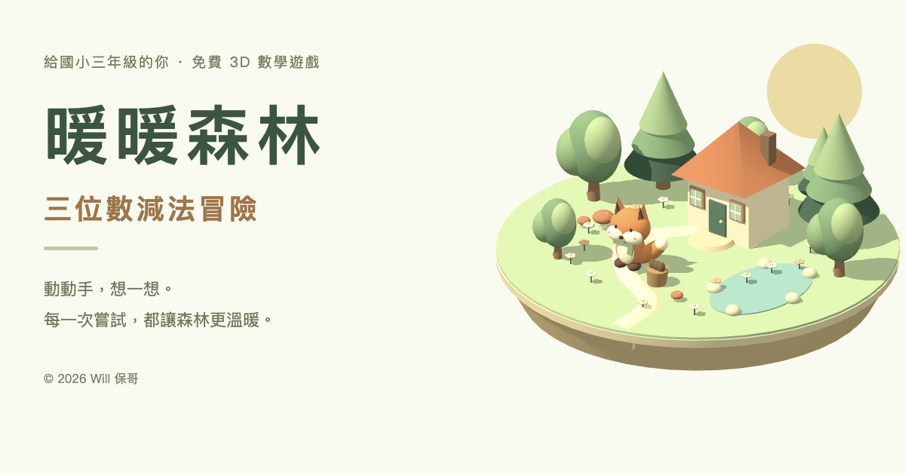

# 暖暖森林：三位數減法冒險

給國小三年級的免費 3D 數學教學遊戲。和小狐狸暖暖一起，用看得見、能操作的位值積木，理解三位數減法與退位。

**[開始遊玩](https://subtraction-forest.gh.miniasp.com/)** · [版本紀錄](CHANGELOG.md) · [MIT 授權](LICENSE)



## 孩子怎麼玩？

1. 選一段森林旅程，看看動物朋友需要哪些物資。
2. 先想想「原本有的 − 送出的 = 剩下的」，也可以直接操作積木。
3. 從個位開始送出積木。不夠的時候，把 1 片百位換成 10 條十位，或把 1 條十位換成 10 個個位。
4. 寫下答案，用加法反向檢查。完成三個任務後，收下朋友的感謝與紀念章。

沒有倒數、扣分或排行榜。答錯會收到具體提示；「退回一步」讓孩子有空間換個方法再試。首頁的心情選擇會回應孩子當下的感受，完成後則鼓勵說出自己的發現。

| 旅程     | 練習重點   | 第一個任務 |
| -------- | ---------- | ---------- |
| 暖陽小徑 | 不退位減法 | 365 − 142  |
| 蘑菇森林 | 一次退位   | 432 − 217  |
| 星光溪谷 | 連續退位   | 532 − 278  |
| 雲朵樹屋 | 跨零退位   | 402 − 176  |

每站 3 題，共 12 道固定題目。四站都可以直接選擇，也可以依順序探索。

## 操作與無障礙

- 滑鼠或觸控：拖曳旋轉 3D 場景；點積木或對應的「送出」按鈕操作。
- 鍵盤：`Tab` 移動、`Enter` / 空白鍵啟動按鈕；答案欄可輸入數字並按 `Enter` 送出。
- 說明視窗可用 `Esc` 關閉，焦點會回到原本的按鈕。
- 每個位值都有文字數量與按鈕；3D 顯示失敗時仍然可以學習。
- 提示透過 live region 播報；支援系統的減少動態效果偏好。
- 音效預設關閉，可以在頁首開啟。保留單一森林配色。

## 本機開發

使用 **Bun 1.3.13 以上**；CI 固定使用 1.3.13。Bun 負責安裝、開發伺服器、測試與正式打包。

```bash
git clone https://github.com/doggy8088/subtraction-forest.git
cd subtraction-forest
bun install --frozen-lockfile
bun run dev
```

開啟終端機顯示的本機網址，預設為 `http://127.0.0.1:5173`。可用 `PORT=5176 bun run dev` 指定連接埠。

```bash
bun test              # 數學邏輯、2,000 道樣本守恆檢查、儲存容錯
bun run typecheck     # TypeScript 型別檢查
bun run format:check  # 原始碼格式檢查
bun run build         # 正式建置；建置警告也會使指令失敗
bun run check:site    # 檢查 dist 的 SEO、JSON-LD、圖示與靜態資源
bun run preview      # 預覽正式建置
bun run format       # 統一程式碼格式
```

## 專案結構

```text
src/
  App.tsx                   首頁、任務、結算、紀念冊
  components/ForestScene.tsx Three.js 森林與位值積木
  components/FoxFace.tsx     小狐狸陪伴角色
  game/logic.ts             純函式：題庫、位值交換、送出與提示
  game/logic.test.ts         數學與任務狀態測試
  game/storage.ts           紀念冊與音效設定
  game/storage.test.ts       損壞資料與儲存失敗測試
  game/sound.ts             Web Audio 音效
  style.css                 響應式介面
public/                     分享卡、圖示、manifest、robots、sitemap、CNAME
design/                     可重製的分享卡與圖示設計稿
scripts/                    Bun 伺服器、正式建置與靜態網站檢查
.github/workflows/          CI 與 GitHub Pages 部署
```

技術：React、TypeScript、Three.js、Bun、Phosphor Icons。森林與積木由程式即時繪製，不依賴外部模型或字體服務。

## SEO 與靜態發佈

- HTML 直接包含教學介紹，JavaScript 載入後切換成互動遊戲。
- canonical、OpenGraph、Twitter Card、JSON-LD、robots.txt 與 sitemap.xml 統一使用正式網域。
- 分享卡為 1200 × 630 PNG；提供 SVG、ICO、PNG favicon、Apple 圖示與安裝 manifest。
- `design/social-card.html` 可透過 Bun 開發伺服器開啟，以 1200 × 630 瀏覽器視窗重新輸出分享卡；`design/icon.html` 提供圖示來源。
- 網站僅有一個公開入口；遊戲內狀態不是獨立網址，不放進 sitemap。
- SEO 資訊不代表搜尋引擎已收錄或保證排名。

推送 `main` 後，GitHub Actions 依序安裝依賴、檢查格式、測試、建置和檢查靜態資源，再把 `dist/` 部署到 GitHub Pages。PR 執行相同驗證，但不部署。

正式網址：**https://subtraction-forest.gh.miniasp.com/**

- Pages 發佈來源：GitHub Actions，`main` 分支。
- 自訂網域：`subtraction-forest.gh.miniasp.com`。
- DNS：CNAME 指向 `doggy8088.github.io`。
- 根目錄 `CNAME` 與 `public/CNAME` 保持一致；後者會輸出到 `dist/CNAME`。
- HTTPS 憑證由 GitHub Pages 管理，並啟用 HTTPS 強制轉址。

## 版本管理

每個完整變更分開 commit；正式版本使用帶說明的 Git tag，摘要記在 [CHANGELOG.md](CHANGELOG.md)。

```bash
git log --oneline --decorate       # 查看每次變更
git show v0.1.0                    # 查看初版標記
git diff v0.1.0..HEAD              # 與初版比較
```

後續發版先更新 `package.json`、lockfile 和 CHANGELOG，通過檢查後再提交、建立版本標籤並推送。避免改寫已公開的版本歷史。

## 資料與限制

不用登入，不收集姓名，不使用廣告或分析追蹤。紀念章和音效設定只保存在目前瀏覽器的 `localStorage`；網頁與資源仍由 GitHub Pages 提供。

- 換裝置、清除網站資料或瀏覽器阻擋儲存時，紀念冊無法保留。
- 完成整站才會記錄紀念章；離開或重新整理會重設進行中的任務。
- 目前是三位數減法原型，固定 12 題，沒有帳號、老師後台、跨裝置同步或隨機出題。
- 3D 需要 WebGL2；無法使用時保留文字與按鈕替代。
- manifest 提供加入主畫面資訊，沒有 service worker，不宣稱離線可用。

## 作者與授權

**© 2026 [Will 保哥](https://github.com/doggy8088)**。本專案以 [MIT License](LICENSE) 開源。教學題目與角色情境為本站設計；第三方套件依其各自授權使用。
